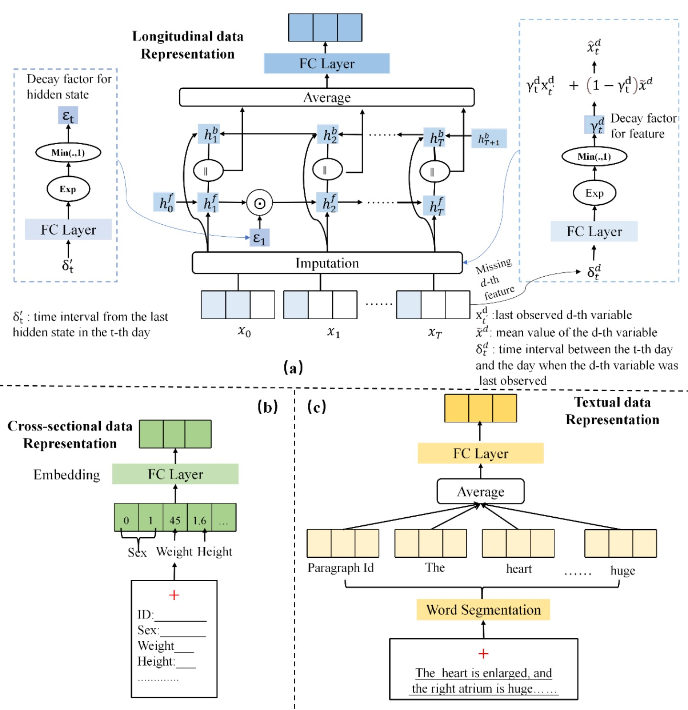

# AI based Hemodialysis Mortality Outcome Prediction

## Abstract
Hemodialysis is the primary treatment for end-stage renal disease patients, but its mortality rate is still unacceptably high. Using data from 63,499 patients at 285 medical centers, we developed a Hemodialysis Early Warning and Intervention System (HEWIS) to identify hemodialysis patients at high risk of death and give treatment recommendations. HEWIS incorporates data from different modalities and innovates medical time series data processing, which achieved 0.82 in the Area under the ROC Curve (AUC) metric. We then conducted a pragmatic clinical trial to evaluate whether HEWIS could help reduce the mortality rate of hemodialysis patients in the clinical setting. 9,965 hemodialysis patients from 58 dialysis centers were included in the analysis (N = 5,216 intervention; N = 4,749 control). The trial achieved its primary endpoint, indicating that HEWIS-guided intervention reduced the three-month mortality rate of hemodialysis patients (3.92% in the control group, 2.40% in the intervention group, odds ratio (OR) 0.45 (0.25-0.78), P < 0.001), with a more pronounced effect in primary hospitals (interaction P = 0.04). **This repo is the implementation of the HEWIS predictor.**

## Model Illustration


## Getting started
1.  Install dependencies:
    ```sh
    conda create -n HEP python=3.8
    conda activate HEP
    pip install -r requirements.txt
    ```
2. Build pytorch environment with gpu (run on RTX3090):
    ```sh
   pip install torch==1.8.1+cu111 torchvision==0.9.1+cu111 torchaudio==0.8.1 -f https://download.pytorch.org/whl/torch_stable.html
    ```

## Data preparation
1. Prepare files containing patient input exam data along with the corresponding mortality outcomes, and place them in the 'data' directory.
    ``` 
    data
    ├── case_data_cs.csv
    ├── case_data_long.csv
    ├── case_data_text.csv
    ├── train_corpus.csv
    ├── y_1month.npy
    └── y_3month.npy
    ```

    **case_data_cs.csv**: cross-sectional data of patients

    **case_data_long.csv**: longitudinal data of patients

    **case_data_text.csv**: text data of patients

    **train_corpus.csv**: containing corpus for training the Doc2Vec model

    These files contains only synthesized data for better patient privacy protection.

2. Extract data from the .csv files and process them into the input feature formats by: 

    ```sh
    python preprocess.py
    ```

    Then you will obtain:

    ```
    data
    ├── cs_data.npy
    ├── data_long.npz
    └──text_emb.npy
    ```

## Train and evaluation

1. Train a model for one-month mortality prediction and evaluate it by:
    ```sh
    CUDA_VISIBLE_DEVICES=0 python main.py --label_type 1_month --focal_weight 0.025
    ```
2. Train a model for three-month mortality prediction and evaluate it by:

    ```sh
    CUDA_VISIBLE_DEVICES=0 python main.py --label_type 3_month --focal_weight 0.07
    ```

